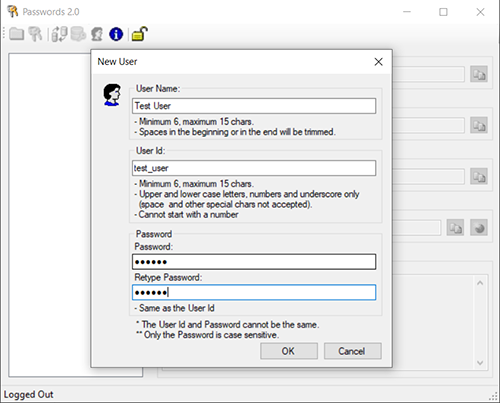
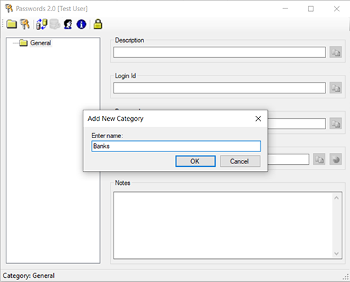

## Passwords 2.0

This project contains the implementation of a desktop application used to manage passwords. It encrypts and stores the password and other information related to it, such as the login ID, web address, description and other necessary information.

This is a multi-user application where each piece of data is encrypted using the user’s main password as the encryption key, which means that no one is able to access the other user’s data without their password, not even the data base administrator.

When the application is open, a login window is displayed.

To create a new user, the button 'Register User' must be pressed.

The specifications - such as characters allowed, maximum and minimum size, etc. - are found in the New User pop-up window.

The category 'General' is the default category. New categories may be added by pressing the 'New Category' button.

To create and store a new record, click the button 'New Record', fill in the text boxes with the required information, and click 'Save'.

The newly added record can be seen on the left panel by clicking the item on the right panel.

It is important to notice that when a new record is created, all its data is encrypted using the user's main password as the encryption key, which means that it is impossible for any other user, or the database admin, to decrypt the data without the user's password.

The user information may be modified or the entire profile and data may be deleted. To do that, press 'Edit User' and the pop-up window below will be displayed. 

If the user logs in and remains idle for 8 minutes, the application automatically logs out.

All user data is stored into a MS SQL Server database. The database schema can be found in the file database_schema.sql.

You can view and download the source files [on GitHub](https://github.com/phb2911/Passwords).

### Future Plans

Convert the code from Visual Basic .Net to C#.

Although many tools used to convert Visual Basic .Net to C# and vice-versa are available, my intention is to do this manually which, in my opinion, is more reliable.

### MIT License

**Copyright (c) 2022 Pablo Borges**

Permission is hereby granted, free of charge, to any person obtaining a copy of this software and associated documentation files (the "Software"), to deal in the Software without restriction, including without limitation the rights to use, copy, modify, merge, publish, distribute, sublicense, and/or sell copies of the Software, and to permit persons to whom the Software is furnished to do so, subject to the following conditions:

The above copyright notice and this permission notice shall be included in all copies or substantial portions of the Software.

THE SOFTWARE IS PROVIDED "AS IS", WITHOUT WARRANTY OF ANY KIND, EXPRESS OR IMPLIED, INCLUDING BUT NOT LIMITED TO THE WARRANTIES OF MERCHANTABILITY, FITNESS FOR A PARTICULAR PURPOSE AND NONINFRINGEMENT. IN NO EVENT SHALL THE AUTHORS OR COPYRIGHT HOLDERS BE LIABLE FOR ANY CLAIM, DAMAGES OR OTHER LIABILITY, WHETHER IN AN ACTION OF CONTRACT, TORT OR OTHERWISE, ARISING FROM, OUT OF OR IN CONNECTION WITH THE SOFTWARE OR THE USE OR OTHER DEALINGS IN THE SOFTWARE.
