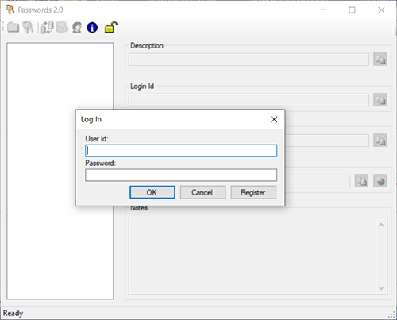

## Passwords 2.0

This project contains the implementation of a desktop application used to manage passwords. It encrypts and stores the password and other information related to it, such as the login ID, web address, description and other necessary information.

This is a multi-user application where each piece of data is encrypted using the user’s main password as the encryption key, which means that no one is able to access the other user’s data without their password, not even the data base administrator.

When the apligacion is open, a login window is displayed.



You can use the [editor on GitHub](https://github.com/phb2911/Passwords/edit/main/docs/index.md) to maintain and preview the content for your website in Markdown files.

Whenever you commit to this repository, GitHub Pages will run [Jekyll](https://jekyllrb.com/) to rebuild the pages in your site, from the content in your Markdown files.

### Markdown

Markdown is a lightweight and easy-to-use syntax for styling your writing. It includes conventions for

```markdown
Syntax highlighted code block

# Header 1
## Header 2
### Header 3

- Bulleted
- List

1. Numbered
2. List

**Bold** and _Italic_ and `Code` text

[Link](url) and 
```

For more details see [Basic writing and formatting syntax](https://docs.github.com/en/github/writing-on-github/getting-started-with-writing-and-formatting-on-github/basic-writing-and-formatting-syntax).

### Jekyll Themes

Your Pages site will use the layout and styles from the Jekyll theme you have selected in your [repository settings](https://github.com/phb2911/Passwords/settings/pages). The name of this theme is saved in the Jekyll `_config.yml` configuration file.

### Support or Contact

Having trouble with Pages? Check out our [documentation](https://docs.github.com/categories/github-pages-basics/) or [contact support](https://support.github.com/contact) and we’ll help you sort it out.
